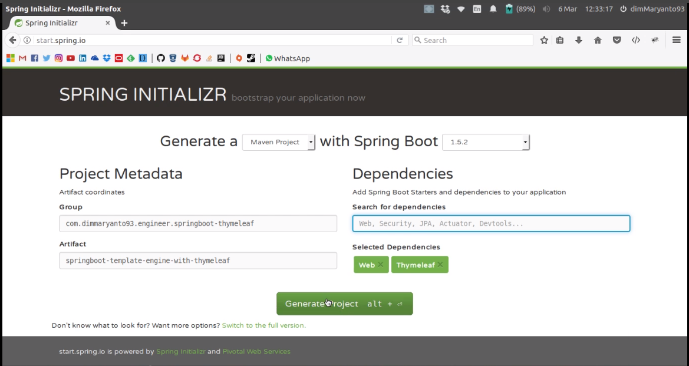
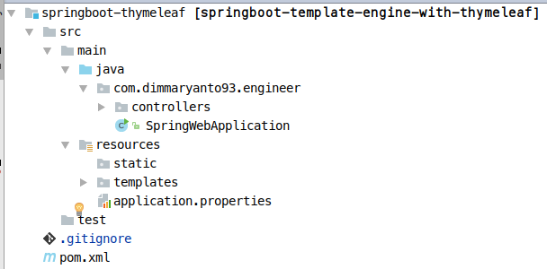

# Belajar Spring Boot with Thymeleaf

Spring Boot adalah bagian dari springframework, seperti yang anda ketahui spring framework adalah framework yang sangat 
popular di saat ini, karena spring framework ini udah semakin besar dan banyak juga yang menggunakannya.

Spring Boot ini sudahlah sangat stable dan mudah digunakan tidak seperti peninggalan Java EE yang lumanya relatif mahal
dari segi server (agak susah untuk di deploy). Jaman sekarang banyak perusahaan menjadikan Spring Framework sebagai pengetahuan standard
bagi programmer yang ingin melamar di perusahaan mereka.

## Memulai Spring Boot

Membuat project, spring framework menyediakan template project di alamat [start.spring.io](http://start.spring.io/) seperti berikut tampilannya:

Setelah itu tambahkan dependencies:

- `Web`
- `Thymeleaf`

Seperti pada gambar tersebut.

## Template Project

Template project yang kita gunakan adalah **Maven Project** seperti berikut:

**Resources Folder:**

- static : digunakan untuk menyimpan file `js`, `css`, `jpg` dan lain-lain.
- templates : digunakan untuk menyimpan file `.html` atau template halaman yang dinamis, artinya yang isinya ingin di render oleh thymeleaf.
