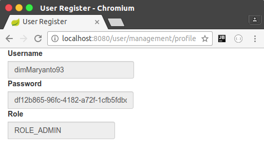

# SpringBoot Thymeleaf Form

Dengan menggunakan template engine di Thymeleaf, kita tidak perlu menggunakan extension lagi,
seperti JSTL di Java Server Page (JSP) karena thymeleaf ini sudah lumanyan lengkap mulai dari:

- Menampilkan Text `th:text`
- Menampilkan link
    - `th:action="@{/path/url}"`
    - `th:href="@{/path/url}"`
    - `th:src="@{/path/url}"`
- Seleksi 
    - `th:if`
    - `th:unless` 
    - `th:switch`
    - `th:case`
- Perulangan 
    - `th:each`
    - `th:for`
- format taggal, uang dll.

## Menampilkan data

Untuk menampilkan data, kita buat dulu domain modelnya contohnya saya buat `UserManagement` 
dalam package `com.dimmaryanto93.engineer.entities` seperti berikut:

```java
package com.dimmaryanto93.engineer.entities;

public class UserManagement {
    private Integer id;
    private String username;
    private String password;
    private String role;

    // setter & getter here
}
```

Setelah itu kita buat halaman `.html` di dalam 
folder `src/main/resources/templates`, buat folder lagi 
dengan nama `usermanagement` dan buat file dengan nama `register.html` seperti berikut:

```html
<!DOCTYPE html>
<html xmlns:th="http://www.thymeleaf.org" lang="en"
      xmlns="http://www.w3.org/1999/xhtml">
<head>
    <meta charset="UTF-8"/>
    <title>User Register</title>
    <link href="webjars/bootstrap/3.3.4/css/bootstrap.min.css"
          th:href="@{/webjars/bootstrap/3.3.4/css/bootstrap.min.css}"
          rel="stylesheet" media="screen"/>
    <script src="webjars/jquery/1.11.1/jquery.min.js"
            th:src="@{/webjars/jquery/1.11.1/jquery.min.js}"></script>
</head>
<body class="container-fluid">
    
    <!--/*@thymesVar id="usermanagement" type="com.dimmaryanto93.engineer.entities.UserManagement"*/-->
    <div class="form-group form-horizontal" th:object="${usermanagement}">
        <div class="input-group">
            <label class="control-label">Username</label>
            <input th:value="*{username}" class="form-control" readonly="readonly"/>
        </div>
        <div class="input-group">
            <label class="control-label">Password</label>
            <input th:value="*{password}" class="form-control" readonly="readonly"/>
        </div>
        <div class="input-group">
            <label class="control-label">Role</label>
            <input th:value="*{role}" class="form-control" readonly="readonly"/>
        </div>
    </div>
</body>
</html>
```

**Penjelasan**

- `<div th:object="${usermanagement}">...</div>` menerima masukan berupa object dengan nama parameter dari controller `usernagement`
- `<!--/*@thymesVar id="usermanagement" type="com.dimmaryanto93.engineer.entities.UserManagement"*/-->` 
digunakan untuk dokumentasi paramenter `usermanagement` objectnya berupa kelas dari `com.dimmaryanto93.engineer.entities.UserManagement`
- `<input th:value="*{username}" />` digunakan untuk menampilkan dengan property `com.dimmaryanto93.engineer.entities.UserManagement.username` jadi bisa disingkat dengan `*{username}` karena sudah di deklarasi dengan `th:object="usermanagement"`, 
sebenarnya seharusnya seperti ini `th:value="${usermanagement.username}"` dan seterusnya.

Kemudian kita buat controllernya di package `com.dimmaryanto93.engineer.controllers` buat dengan nama `UserManagementController` seperti berikut:

```java
package com.dimmaryanto93.engineer.controllers;

import com.dimmaryanto93.engineer.entities.UserManagement;
import org.slf4j.Logger;
import org.slf4j.LoggerFactory;
import org.springframework.stereotype.Controller;
import org.springframework.ui.Model;
import org.springframework.web.bind.annotation.RequestMapping;

import java.util.Arrays;
import java.util.UUID;

/**
 * Created by dimmaryanto93 on 06/03/17.
 */
@Controller
@RequestMapping("/user/management")
public class UserManagementController {
    private Logger console = LoggerFactory.getLogger(UserManagementController.class);

    @GetMapping("/profile")
    public String getUserProfile(Model model) {
        UserManagement user = new UserManagement();
        user.setUsername("dimMaryanto93");
        user.setPassword(UUID.randomUUID().toString());
        user.setRole("ROLE_ADMIN");
        model.addAttribute("usermanagement", user);
        return "/usermanagement/profile";
    }

} 
```

**Penjelasan** 
- `@RequestMapping("/user/management")`, kita membuat url `localhost:8080/user/management`
- `@GetMapping("/profile")`, kita membuat ketika ada request dengan method http `GET` di url `localhost/8080/user/management/profile` maka jalankan method tersebut.
- `org.springframework.ui.Model`, Kita memasukan sebuah parameter ke halaman `/usermanagement/register.html`
- `model.addAttribute("usermanagement", user);`, Kita membuat sebuah paramenter dengan nama `usermanagement` isinya adalah object user yang kita buat tersebut.

Jika di running dan akses url [localhost:8080/user/management/profile](http://localhost:8080/user/management/profile) maka hasilnya menampilkan seperti berikut:

