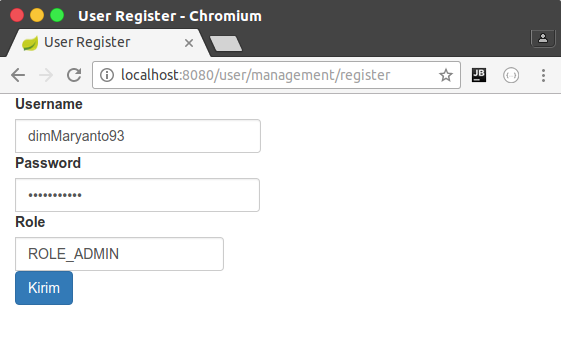

# SpringBoot Thymeleaf Form

Dengan menggunakan template engine di Thymeleaf, kita tidak perlu menggunakan extension lagi,
seperti JSTL di Java Server Page (JSP) karena thymeleaf ini sudah lumanyan lengkap mulai dari:

- Menampilkan Text `th:text`
- Menampilkan link
    - `th:action="@{/path/url}"`
    - `th:href="@{/path/url}"`
    - `th:src="@{/path/url}"`
- Seleksi 
    - `th:if`
    - `th:unless` 
    - `th:switch`
    - `th:case`
- Perulangan 
    - `th:each`
    - `th:for`
- format taggal, uang dll.

## Menampilkan data

Untuk menampilkan data, kita buat dulu domain modelnya contohnya saya buat `UserManagement` 
dalam package `com.dimmaryanto93.engineer.entities` seperti berikut:

```java
package com.dimmaryanto93.engineer.entities;

public class UserManagement {
    private Integer id;
    private String username;
    private String password;
    private String role;

    // setter & getter here
}
```

Setelah itu kita buat halaman `.html` di dalam folder `src/main/resources/templates`, buat folder lagi 
dengan nama `usermanagement` dan buat file dengan nama `register.html` seperti berikut:

```html
<!DOCTYPE html>
<html xmlns:th="http://www.thymeleaf.org" lang="en"
      xmlns="http://www.w3.org/1999/xhtml">
<head>
    <meta charset="UTF-8"/>
    <title>User Register</title>
    <link href="webjars/bootstrap/3.3.4/css/bootstrap.min.css"
          th:href="@{/webjars/bootstrap/3.3.4/css/bootstrap.min.css}"
          rel="stylesheet" media="screen"/>
    <script src="webjars/jquery/1.11.1/jquery.min.js"
            th:src="@{/webjars/jquery/1.11.1/jquery.min.js}"></script>
</head>
<body class="container-fluid">
    
    <!--/*@thymesVar id="usermanagement" type="com.dimmaryanto93.engineer.entities.UserManagement"*/-->
    <div class="form-group form-horizontal" th:object="${usermanagement}">
        <div class="input-group">
            <label class="control-label">Username</label>
            <input th:value="*{username}" class="form-control" readonly="readonly"/>
        </div>
        <div class="input-group">
            <label class="control-label">Password</label>
            <input th:value="*{password}" class="form-control" readonly="readonly"/>
        </div>
        <div class="input-group">
            <label class="control-label">Role</label>
            <input th:value="*{role}" class="form-control" readonly="readonly"/>
        </div>
    </div>
</body>
</html>
```

**Penjelasan**

- `<div th:object="${usermanagement}">...</div>` menerima masukan berupa object dengan nama parameter dari controller `usernagement`
- `<!--/*@thymesVar id="usermanagement" type="com.dimmaryanto93.engineer.entities.UserManagement"*/-->` 
digunakan untuk dokumentasi paramenter `usermanagement` objectnya berupa kelas dari `com.dimmaryanto93.engineer.entities.UserManagement`
- `<input th:value="*{username}" />` digunakan untuk menampilkan dengan property `com.dimmaryanto93.engineer.entities.UserManagement.username` jadi bisa disingkat dengan `*{username}` karena sudah di deklarasi dengan `th:object="usermanagement"`, 
sebenarnya seharusnya seperti ini `th:value="${usermanagement.username}"` dan seterusnya.

Kemudian kita buat controllernya di package `com.dimmaryanto93.engineer.controllers` buat dengan nama `UserManagementController` seperti berikut:

```java
package com.dimmaryanto93.engineer.controllers;

import com.dimmaryanto93.engineer.entities.UserManagement;
import org.slf4j.Logger;
import org.slf4j.LoggerFactory;
import org.springframework.stereotype.Controller;
import org.springframework.ui.Model;
import org.springframework.web.bind.annotation.RequestMapping;

import java.util.Arrays;
import java.util.UUID;

/**
 * Created by dimmaryanto93 on 06/03/17.
 */
@Controller
@RequestMapping("/user/management")
public class UserManagementController {
    private Logger console = LoggerFactory.getLogger(UserManagementController.class);

    @GetMapping("/profile")
    public String getUserProfile(Model model) {
        UserManagement user = new UserManagement();
        user.setUsername("dimMaryanto93");
        user.setPassword(UUID.randomUUID().toString());
        user.setRole("ROLE_ADMIN");
        model.addAttribute("usermanagement", user);
        return "/usermanagement/profile";
    }

} 
```

**Penjelasan** 
- `@RequestMapping("/user/management")`, kita membuat url `localhost:8080/user/management`
- `@GetMapping("/profile")`, kita membuat ketika ada request dengan method http `GET` di url `localhost/8080/user/management/profile` maka jalankan method tersebut.
- `org.springframework.ui.Model`, Kita memasukan sebuah parameter ke halaman `/usermanagement/register.html`
- `model.addAttribute("usermanagement", user);`, Kita membuat sebuah paramenter dengan nama `usermanagement` isinya adalah object user yang kita buat tersebut.

Jika di running dan akses url [localhost:8080/user/management/profile](http://localhost:8080/user/management/profile) maka hasilnya menampilkan seperti berikut:


## Mengirim data

Setelah kita tadi udah menamapilkan data dari controller ke halaman sekarang kita 
lanjutkan untuk mengirim dari halaman ke controller dengan http method `POST`, caranya sama kita buat dulu
file dengan nama `register.html` dalam folder `src/main/resources/templates/usermanagement/` seperti berikut:

```html
<!DOCTYPE html>
<html xmlns:th="http://www.thymeleaf.org" lang="en"
      xmlns="http://www.w3.org/1999/xhtml">
<head>
    <meta charset="UTF-8"/>
    <title>User Register</title>
    <link href="webjars/bootstrap/3.3.4/css/bootstrap.min.css"
          th:href="@{/webjars/bootstrap/3.3.4/css/bootstrap.min.css}"
          rel="stylesheet" media="screen"/>
    <script src="webjars/jquery/1.11.1/jquery.min.js"
            th:src="@{/webjars/jquery/1.11.1/jquery.min.js}"></script>
</head>
<body class="container-fluid">

    <!--/*@thymesVar id="usermanagement" type="com.dimmaryanto93.engineer.entities.UserManagement"*/-->
    <form class="form-group form-horizontal"
          th:object="${usermanagement}" th:action="@{/user/management/register}" th:method="post">
        <div class="input-group">
            <label class="control-label">Username</label>
            <input type="text" th:field="*{username}" value="Dimas Maryanto" class="form-control"/>
        </div>
        <div class="input-group">
            <label class="control-label">Password</label>
            <input type="password" th:field="*{password}" value="dimas889563" class="form-control"/>
        </div>
        <div class="input-group">
            <label class="control-label">Role</label>
            <input type="text" th:field="*{role}" value="ADMIN" class="form-control"/>
        </div>
        
        <div class="input-group">
            <input type="submit" class="btn btn-primary" value="Kirim"/>
        </div>
    </form>
</body>
</html>
```

**Penjelasan**

- Kita harus definisikan dulu form, sama seperti html biasa hanya ada beberapa tambahan seperti berikut:

```html
<form class="form-group form-horizontal"
          th:object="${usermanagement}" th:action="@{/user/management/register}" th:method="post">
          <!--field-->
</form>
```
- `th:object="${usermanagement}"`, variable akan `usermanager` akan mendeteksi apakah object tersebut memiliki nilai, jika punya tampilkan ke `field`.
- `th:action="@{/user/management/register}"` akan di kirim ke url mana contohnya `localhost:8080/user/management/register`
- `th:method="post"` method http yang digunakan adalah `POST` selain itu ada juga `GET`

- Setelah itu kita definisikan `field` yang digunakan gunakan tag seperti berikut:

```html
<input type="text" th:field="*{username}" value="Dimas Maryanto"/>
```

- `th:field="*{username}"` artinya sama seperti `th:value="${usermanagement.username}"`

Kemudian kita buat controller, untuk menghandle request dan responsenya untuk url dengan method http `POST` tersebut. tambahkan method seperti berikut di 
kelas `UserManagementController` 

```java
package com.dimmaryanto93.engineer.controllers;

import com.dimmaryanto93.engineer.entities.UserManagement;
import org.slf4j.Logger;
import org.slf4j.LoggerFactory;
import org.springframework.stereotype.Controller;
import org.springframework.web.bind.annotation.ModelAttribute;
import org.springframework.web.bind.annotation.PostMapping;
import org.springframework.web.bind.annotation.RequestMapping;

import java.util.Arrays;
import java.util.UUID;

/**
 * Created by dimmaryanto93 on 06/03/17.
 */
@Controller
@RequestMapping("/user/management")
public class UserManagementController {
    private Logger console = LoggerFactory.getLogger(UserManagementController.class);

    // untuk menampilkan form input
    @GetMapping("/register")
    public String getUserManagement(Model model) {
        UserManagement user = new UserManagement();
        user.setUsername("dimMaryanto93");
        user.setPassword(UUID.randomUUID().toString());
        user.setRole("ROLE_ADMIN");
        model.addAttribute("usermanagement", user);
        return "/usermanagement/register";
    }

    // untuk menerima inputan
    @PostMapping("/register")
    public String postingUser(@ModelAttribute UserManagement user) {
        console.info("informasi user {} : {} : {}", user.getUsername(), user.getPassword(), user.getRole());
        return "redirect:/user/management/register";
    }
}
```

**Penjelasan**

- `@PostMapping("/register")`, digunakan untuk memerika request ke alamat `/user/management/register` dengan method `POST`
- `@ModelAttribute UserManagement user`, Nilai yang kita gunakan di halaman `register.html` akan langsung di render oleh `spring-webmvc` 
manjadi sebuah object `com.dimmaryanto93.engineer.entities.UserManagement`
- `return "redirect:/user/management/register";`, digunakan untuk melakukan redirect ke alamat `/user/management/register`

Sekarang coba jalankan dan coba akses url [localhost:8080/user/management/register](http://localhost:8080/user/management/register)
maka akan tampil view seperti berikut:



Setelah itu klik `Kirim` maka coba liat di console terdapat output seperti berikut:

```bash
  .   ____          _            __ _ _
 /\\ / ___'_ __ _ _(_)_ __  __ _ \ \ \ \
( ( )\___ | '_ | '_| | '_ \/ _` | \ \ \ \
 \\/  ___)| |_)| | | | | || (_| |  ) ) ) )
  '  |____| .__|_| |_|_| |_\__, | / / / /
 =========|_|==============|___/=/_/_/_/
 :: Spring Boot ::        (v1.5.2.RELEASE)

2017-03-07 22:46:14.679  INFO 8450 --- [           main] c.d.engineer.SpringWebApplication        : Starting SpringWebApplication on E5-473G with PID 8450 (/home/dimmaryanto93/workspace/belajar/springboot-thymeleaf/target/classes started by dimmaryanto93 in /home/dimmaryanto93/workspace/belajar/springboot-thymeleaf)
2017-03-07 22:46:14.687  INFO 8450 --- [           main] c.d.engineer.SpringWebApplication        : No active profile set, falling back to default profiles: default
2017-03-07 22:46:15.304  INFO 8450 --- [           main] ationConfigEmbeddedWebApplicationContext : Refreshing org.springframework.boot.context.embedded.AnnotationConfigEmbeddedWebApplicationContext@3cec0413: startup date [Tue Mar 07 22:46:15 WIB 2017]; root of context hierarchy
2017-03-07 22:46:16.967  INFO 8450 --- [           main] s.b.c.e.t.TomcatEmbeddedServletContainer : Tomcat initialized with port(s): 8080 (http)
2017-03-07 22:46:16.985  INFO 8450 --- [           main] o.apache.catalina.core.StandardService   : Starting service Tomcat
2017-03-07 22:46:16.986  INFO 8450 --- [           main] org.apache.catalina.core.StandardEngine  : Starting Servlet Engine: Apache Tomcat/8.5.11
2017-03-07 22:46:17.121  INFO 8450 --- [ost-startStop-1] o.a.c.c.C.[Tomcat].[localhost].[/]       : Initializing Spring embedded WebApplicationContext
2017-03-07 22:46:17.121  INFO 8450 --- [ost-startStop-1] o.s.web.context.ContextLoader            : Root WebApplicationContext: initialization completed in 1832 ms
2017-03-07 22:46:17.315  INFO 8450 --- [ost-startStop-1] o.s.b.w.servlet.ServletRegistrationBean  : Mapping servlet: 'dispatcherServlet' to [/]
2017-03-07 22:46:17.318  INFO 8450 --- [ost-startStop-1] o.s.b.w.servlet.FilterRegistrationBean   : Mapping filter: 'characterEncodingFilter' to: [/*]
2017-03-07 22:46:17.319  INFO 8450 --- [ost-startStop-1] o.s.b.w.servlet.FilterRegistrationBean   : Mapping filter: 'hiddenHttpMethodFilter' to: [/*]
2017-03-07 22:46:17.319  INFO 8450 --- [ost-startStop-1] o.s.b.w.servlet.FilterRegistrationBean   : Mapping filter: 'httpPutFormContentFilter' to: [/*]
2017-03-07 22:46:17.319  INFO 8450 --- [ost-startStop-1] o.s.b.w.servlet.FilterRegistrationBean   : Mapping filter: 'requestContextFilter' to: [/*]
2017-03-07 22:46:17.778  INFO 8450 --- [           main] s.w.s.m.m.a.RequestMappingHandlerAdapter : Looking for @ControllerAdvice: org.springframework.boot.context.embedded.AnnotationConfigEmbeddedWebApplicationContext@3cec0413: startup date [Tue Mar 07 22:46:15 WIB 2017]; root of context hierarchy
2017-03-07 22:46:17.858  INFO 8450 --- [           main] s.w.s.m.m.a.RequestMappingHandlerMapping : Mapped "{[/login]}" onto public java.lang.String com.dimmaryanto93.engineer.controllers.IndexController.halamanUtama(org.springframework.ui.Model)
2017-03-07 22:46:17.879  INFO 8450 --- [           main] s.w.s.m.m.a.RequestMappingHandlerMapping : Mapped "{[/user/management/register],methods=[GET]}" onto public java.lang.String com.dimmaryanto93.engineer.controllers.UserManagementController.getUserManagement(org.springframework.ui.Model)
2017-03-07 22:46:17.880  INFO 8450 --- [           main] s.w.s.m.m.a.RequestMappingHandlerMapping : Mapped "{[/user/management/profile],methods=[GET]}" onto public java.lang.String com.dimmaryanto93.engineer.controllers.UserManagementController.getUserProfile(org.springframework.ui.Model)
2017-03-07 22:46:17.880  INFO 8450 --- [           main] s.w.s.m.m.a.RequestMappingHandlerMapping : Mapped "{[/user/management/register],methods=[POST]}" onto public java.lang.String com.dimmaryanto93.engineer.controllers.UserManagementController.postingUser(com.dimmaryanto93.engineer.entities.UserManagement)
2017-03-07 22:46:17.882  INFO 8450 --- [           main] s.w.s.m.m.a.RequestMappingHandlerMapping : Mapped "{[/error],produces=[text/html]}" onto public org.springframework.web.servlet.ModelAndView org.springframework.boot.autoconfigure.web.BasicErrorController.errorHtml(javax.servlet.http.HttpServletRequest,javax.servlet.http.HttpServletResponse)
2017-03-07 22:46:17.883  INFO 8450 --- [           main] s.w.s.m.m.a.RequestMappingHandlerMapping : Mapped "{[/error]}" onto public org.springframework.http.ResponseEntity<java.util.Map<java.lang.String, java.lang.Object>> org.springframework.boot.autoconfigure.web.BasicErrorController.error(javax.servlet.http.HttpServletRequest)
2017-03-07 22:46:17.925  INFO 8450 --- [           main] o.s.w.s.handler.SimpleUrlHandlerMapping  : Mapped URL path [/webjars/**] onto handler of type [class org.springframework.web.servlet.resource.ResourceHttpRequestHandler]
2017-03-07 22:46:17.926  INFO 8450 --- [           main] o.s.w.s.handler.SimpleUrlHandlerMapping  : Mapped URL path [/**] onto handler of type [class org.springframework.web.servlet.resource.ResourceHttpRequestHandler]
2017-03-07 22:46:17.974  INFO 8450 --- [           main] o.s.w.s.handler.SimpleUrlHandlerMapping  : Mapped URL path [/**/favicon.ico] onto handler of type [class org.springframework.web.servlet.resource.ResourceHttpRequestHandler]
2017-03-07 22:46:18.593  INFO 8450 --- [           main] o.s.j.e.a.AnnotationMBeanExporter        : Registering beans for JMX exposure on startup
2017-03-07 22:46:18.684  INFO 8450 --- [           main] s.b.c.e.t.TomcatEmbeddedServletContainer : Tomcat started on port(s): 8080 (http)
2017-03-07 22:46:18.690  INFO 8450 --- [           main] c.d.engineer.SpringWebApplication        : Started SpringWebApplication in 4.491 seconds (JVM running for 9.7)
2017-03-07 22:46:35.529  INFO 8450 --- [nio-8080-exec-1] o.a.c.c.C.[Tomcat].[localhost].[/]       : Initializing Spring FrameworkServlet 'dispatcherServlet'
2017-03-07 22:46:35.529  INFO 8450 --- [nio-8080-exec-1] o.s.web.servlet.DispatcherServlet        : FrameworkServlet 'dispatcherServlet': initialization started
2017-03-07 22:46:35.562  INFO 8450 --- [nio-8080-exec-1] o.s.web.servlet.DispatcherServlet        : FrameworkServlet 'dispatcherServlet': initialization completed in 33 ms
2017-03-07 22:47:06.312  INFO 8450 --- [nio-8080-exec-6] c.d.e.c.UserManagementController         : informasi user dimMaryanto93 : dimas889563 : ROLE_ADMIN
```

Dan setelah selesai, coba lihat kembali ke web browser maka akan dikembalikan ke url `localhost:8080/user/management/register`