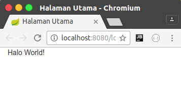
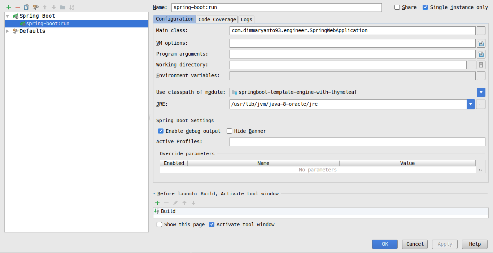
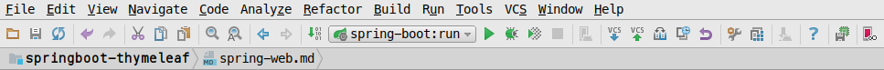

# Spring Web MVC

Spring Boot, Pada dasarnya menyediakan template yang bisa digunakan seperti:

- [thymeleaf.org](http://www.thymeleaf.org/)
- JSP
- [velocity.apache.org](http://velocity.apache.org/)
- [freemarker.org/](http://freemarker.org/)

Dari ke-empat itu sebenarnya yang paling update yaitu [thymeleaf.org](http://www.thymeleaf.org/) maka dari itu kita akan menggunakan template engine Thymeleaf.

Untuk menggunakannya di spring-boot sangat mudah cukup dengan tambahkan dependency seperti berikut:

**pom.xml**

```xml
<dependencies>
    <dependency>
        <groupId>org.springframework.boot</groupId>
        <artifactId>spring-boot-starter-thymeleaf</artifactId>
    </dependency>
    <dependency>
        <groupId>org.springframework.boot</groupId>
        <artifactId>spring-boot-starter-web</artifactId>
    </dependency>
</dependencies>
```

**application.properties**

```properties
spring.thymeleaf.prefix=classpath:/templates/
spring.thymeleaf.suffix=.html
spring.thymeleaf.mode=HTML5
spring.thymeleaf.encoding=UTF-8
spring.thymeleaf.cache=false
```

Dengan begitu kita cukup membuat file dengan extension `.html` dengan menabahkan tag seperti berikut:

```html
<html xmlns:th="http://www.thymeleaf.org" lang="en"
            xmlns="http://www.w3.org/1999/xhtml>
</html>
```

Dan yang perlu dicatat adalah **semua tag harus ditutup semuanya `<open></open>` atau `<open />`**.

## Membuat Halaman Pertama

### View dengan Thymeleaf

- Membuat file `login.html` dalam folder `src/main/resources/templates/`

```html
<!DOCTYPE html>
<html xmlns:th="http://www.thymeleaf.org" lang="en"
      xmlns="http://www.w3.org/1999/xhtml">
    <head>
        <meta charset="UTF-8"/>
        <title>Halaman Utama</title>
    </head>
    <body class="container-fluid">
    <!--/*@thymesVar id="pesan" type="com.dimmaryanto93.engineer.controllers.IndexController"*/-->
    <span th:text="${pesan}">halo spring</span>
    </body>
</html>
```

**Penjelasan**:
- `xmlns="http://www.w3.org/1999/xhtml"` dan `xmlns:th="http://www.thymeleaf.org"`, dengan menambakan attribut tersebut perintah thymeleaf dapat dikenali seperti `th:text`, `th:if` dll.
- `<span th:text="${pesan}">halo spring</span>`, akan menerika sebuah data dari controller yang di tandai dengan variable name `pesan` kemudian isi dari element `span` akan diganti dengan nilai dari variable tersebut.

### Controller

- Membuat Controller, sebagai pemanggil ketika ada request terhadap url tertentu maka akan memanggil view atau function. 
buatlah dengan nama `IndexController` di `src/main/java` dalam package `com.dimmaryanto93.engineer.controllers` seperti berikut:

```java
package com.dimmaryanto93.engineer.controllers;

import org.springframework.stereotype.Controller;
import org.springframework.ui.Model;
import org.springframework.web.bind.annotation.RequestMapping;

@Controller
@RequestMapping("/")
public class IndexController {

    @RequestMapping("login")
    public String halamanUtama(Model model) {
        model.addAttribute("pesan", "Halo World!");
        return "/login";
    }
}
```

**Penjelasan**

- `@Controller`, digunakan untuk menjadikan kelas tersebut sebagai bean.
- `@RequestMapping(value = """)`, digunakan untuk menentukan url seperti contohnya diatas akan menhasilkan url `/login`. Maka ketika kita mengakses url berikut [localhost:8080/login](http://localhost:8080/login)
- `Model`, adalah object yang digunakan untuk merender nilai yang akan di tampilkan ke halaman tersebut contohnya variable `pesan` dengan value `Halo World!` maka di halamanya nanti ketika di jalankan akan menghasilkan text tersebut.
- `return "/login"`, adalah lokasi halaman `login.html` di dalam folder `src/main/resources/templates/login.html`.

## Menjalankan Aplikasi Spring Boot

Untuk menjalankan aplikasi spring-boot pada dasarnya ada banyak cara yaitu salah satunya dengan menggunakan terminal atau IDE (Netbean, Eclipse, IntelliJ IDEA dan lain-lain).

### Running with Terminal

Untuk menjalankan dengan terminal cukup mudah, asalkan anda telah meninstall **Maven** dan **Java Runtime Environment** di Sistem Operasi anda, gunakan perintah seperti berikut:

```bash
mvn clean spring-boot:run
```

maka hasilnya seperti berikut:

```bash
dimmaryanto93@E5-473G:~/workspace/belajar/springboot-thymeleaf$ mvn clean spring-boot:run
[INFO] Scanning for projects...
[INFO]                                                                         
[INFO] ------------------------------------------------------------------------
[INFO] Building Belajar Spring Boot - Thymeleaf 0.0.1-SNAPSHOT

  .   ____          _            __ _ _
 /\\ / ___'_ __ _ _(_)_ __  __ _ \ \ \ \
( ( )\___ | '_ | '_| | '_ \/ _` | \ \ \ \
 \\/  ___)| |_)| | | | | || (_| |  ) ) ) )
  '  |____| .__|_| |_|_| |_\__, | / / / /
 =========|_|==============|___/=/_/_/_/
 :: Spring Boot ::        (v1.5.2.RELEASE)

2017-03-06 16:16:29.534  INFO 30281 --- [           main] c.d.engineer.SpringWebApplication        : Starting SpringWebApplication on E5-473G with PID 30281 (/home/dimmaryanto93/workspace/belajar/springboot-thymeleaf/target/classes started by dimmaryanto93 in /home/dimmaryanto93/workspace/belajar/springboot-thymeleaf)
2017-03-06 16:16:29.540  INFO 30281 --- [           main] c.d.engineer.SpringWebApplication        : No active profile set, falling back to default profiles: default
2017-03-06 16:16:30.223  INFO 30281 --- [           main] ationConfigEmbeddedWebApplicationContext : Refreshing org.springframework.boot.context.embedded.AnnotationConfigEmbeddedWebApplicationContext@42ab24c2: startup date [Mon Mar 06 16:16:30 WIB 2017]; root of context hierarchy
2017-03-06 16:16:31.852  INFO 30281 --- [           main] s.b.c.e.t.TomcatEmbeddedServletContainer : Tomcat initialized with port(s): 8080 (http)
2017-03-06 16:16:31.869  INFO 30281 --- [           main] o.apache.catalina.core.StandardService   : Starting service Tomcat
2017-03-06 16:16:31.871  INFO 30281 --- [           main] org.apache.catalina.core.StandardEngine  : Starting Servlet Engine: Apache Tomcat/8.5.11
2017-03-06 16:16:31.968  INFO 30281 --- [ost-startStop-1] o.a.c.c.C.[Tomcat].[localhost].[/]       : Initializing Spring embedded WebApplicationContext
2017-03-06 16:16:31.969  INFO 30281 --- [ost-startStop-1] o.s.web.context.ContextLoader            : Root WebApplicationContext: initialization completed in 1751 ms
2017-03-06 16:16:32.137  INFO 30281 --- [ost-startStop-1] o.s.b.w.servlet.ServletRegistrationBean  : Mapping servlet: 'dispatcherServlet' to [/]
2017-03-06 16:16:32.143  INFO 30281 --- [ost-startStop-1] o.s.b.w.servlet.FilterRegistrationBean   : Mapping filter: 'characterEncodingFilter' to: [/*]
2017-03-06 16:16:32.144  INFO 30281 --- [ost-startStop-1] o.s.b.w.servlet.FilterRegistrationBean   : Mapping filter: 'hiddenHttpMethodFilter' to: [/*]
2017-03-06 16:16:32.144  INFO 30281 --- [ost-startStop-1] o.s.b.w.servlet.FilterRegistrationBean   : Mapping filter: 'httpPutFormContentFilter' to: [/*]
2017-03-06 16:16:32.144  INFO 30281 --- [ost-startStop-1] o.s.b.w.servlet.FilterRegistrationBean   : Mapping filter: 'requestContextFilter' to: [/*]
2017-03-06 16:16:32.480  INFO 30281 --- [           main] s.w.s.m.m.a.RequestMappingHandlerAdapter : Looking for @ControllerAdvice: org.springframework.boot.context.embedded.AnnotationConfigEmbeddedWebApplicationContext@42ab24c2: startup date [Mon Mar 06 16:16:30 WIB 2017]; root of context hierarchy
2017-03-06 16:16:32.566  INFO 30281 --- [           main] s.w.s.m.m.a.RequestMappingHandlerMapping : Mapped "{[/login]}" onto public java.lang.String com.dimmaryanto93.engineer.controllers.IndexController.halamanUtama(org.springframework.ui.Model)
2017-03-06 16:16:32.571  INFO 30281 --- [           main] s.w.s.m.m.a.RequestMappingHandlerMapping : Mapped "{[/error],produces=[text/html]}" onto public org.springframework.web.servlet.ModelAndView org.springframework.boot.autoconfigure.web.BasicErrorController.errorHtml(javax.servlet.http.HttpServletRequest,javax.servlet.http.HttpServletResponse)
2017-03-06 16:16:32.571  INFO 30281 --- [           main] s.w.s.m.m.a.RequestMappingHandlerMapping : Mapped "{[/error]}" onto public org.springframework.http.ResponseEntity<java.util.Map<java.lang.String, java.lang.Object>> org.springframework.boot.autoconfigure.web.BasicErrorController.error(javax.servlet.http.HttpServletRequest)
2017-03-06 16:16:32.613  INFO 30281 --- [           main] o.s.w.s.handler.SimpleUrlHandlerMapping  : Mapped URL path [/webjars/**] onto handler of type [class org.springframework.web.servlet.resource.ResourceHttpRequestHandler]
2017-03-06 16:16:32.614  INFO 30281 --- [           main] o.s.w.s.handler.SimpleUrlHandlerMapping  : Mapped URL path [/**] onto handler of type [class org.springframework.web.servlet.resource.ResourceHttpRequestHandler]
2017-03-06 16:16:32.687  INFO 30281 --- [           main] o.s.w.s.handler.SimpleUrlHandlerMapping  : Mapped URL path [/**/favicon.ico] onto handler of type [class org.springframework.web.servlet.resource.ResourceHttpRequestHandler]
2017-03-06 16:16:33.306  INFO 30281 --- [           main] o.s.j.e.a.AnnotationMBeanExporter        : Registering beans for JMX exposure on startup
2017-03-06 16:16:33.394  INFO 30281 --- [           main] s.b.c.e.t.TomcatEmbeddedServletContainer : Tomcat started on port(s): 8080 (http)
2017-03-06 16:16:33.400  INFO 30281 --- [           main] c.d.engineer.SpringWebApplication        : Started SpringWebApplication in 4.326 seconds (JVM running for 9.565)
```

Sekarang kita tinggal Browsing di Web Browser seperti `Chrome`, `Firefox` atau `Safari` dan lain-lain di alamat [localhost:8080/login](http://localhost:8080/login) maka hasilnya seperti berikut:



### Running with IntelliJ IDEA

Untuk menjalankan di IntelliJ IDEA ada beberapa yang harus di configurasi, seperti berikut:

`Menu` -> `Run` -> `Edit Configuration` -> `Add new configuration` - `Spring Boot`



**Penjelasan**

- `Name` : isi aja bebas kok.
- `Main Class` : pilih `com.dimmaryanto93.engineer.SpringWebApplication`
- `JRE` : pilih yang version `java-8-oracle`
- Setelah itu klik OK. setelah itu configuration akan muncul di toolbar seperti berikut:



- Klik button start.