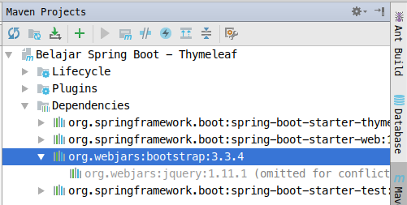
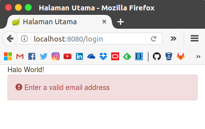

# Spring Boot - Webjars

Webjars adalah Software dependency management untuk web yang fungsinnya 
untuk menambahkan framework css dan javascript yang di include ke dalam jar.

## Menggunakan Bootstrap

Untuk menggunakan `bootstrap` tambahkan dependency di file `pom.xml` seperti berikut:

```xml
<dependencies>
    <!--dependency yang lainnya-->
    <dependency>
        <groupId>org.webjars</groupId>
        <artifactId>bootstrap</artifactId>
        <version>3.3.4</version>
    </dependency>
</dependencies>
```

Nah sekarang tinggal kita jalankan perintah berikut

```bash 
mvn clean package
```

Setelah selasai, maka kita bisa lihat dependencynya bertambah seperti berikut:



Kemudian kita tinggal tambahkan link untuk menginclude file `css` dan `js` bootstrap di file `login.html` seperti berikut:

```html
<link href="webjars/bootstrap/3.3.4/css/bootstrap.min.css"
          th:href="@{/webjars/bootstrap/3.3.4/css/bootstrap.min.css}"
          rel="stylesheet" media="screen"/>
<script src="webjars/jquery/2.1.4/jquery.min.js"
        th:src="@{/webjars/jquery/1.11.1/jquery.min.js}"></script>
```

Dan setelah itu kita check dengan membuat sebuah element alert di bootstrap seperti berikut:

```html
<div class="alert alert-danger" role="alert">
    <span class="glyphicon glyphicon-exclamation-sign" aria-hidden="true"></span>
    <span class="sr-only">Error:</span>
    Enter a valid email address
</div>
```

Jika di jalankan maka hasilnya seperti berikut:

